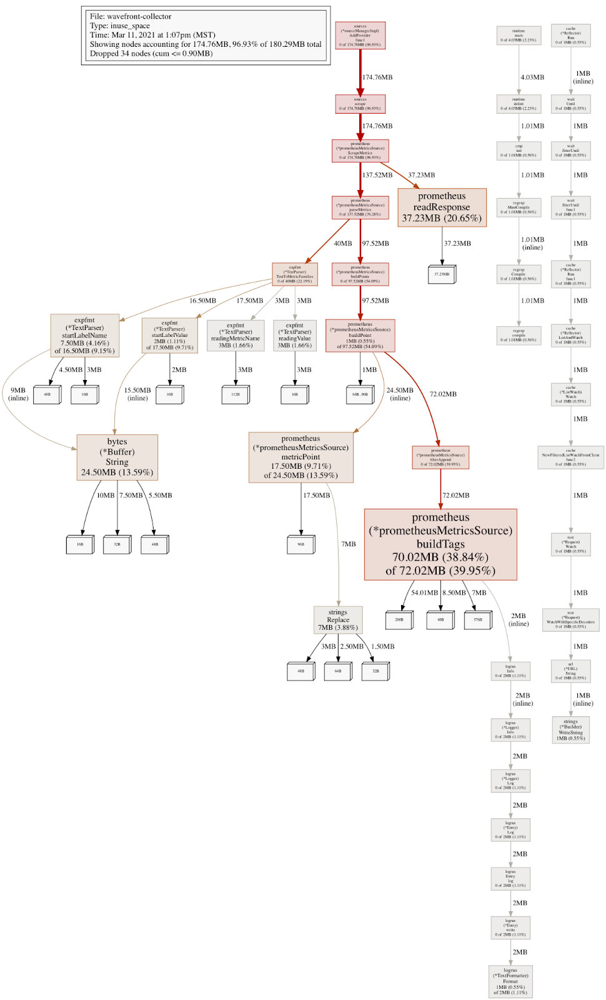
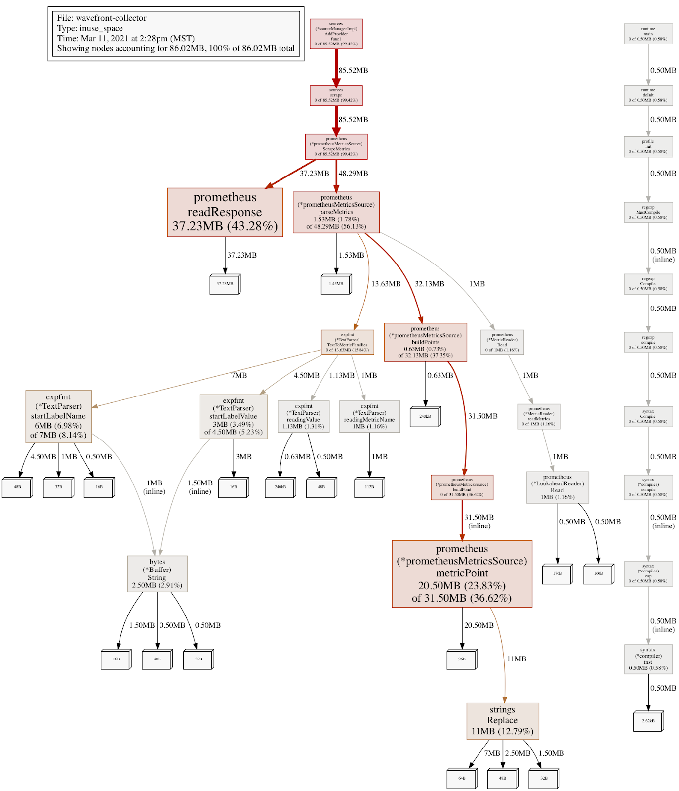

# 20210322 Reducing Collector Memory Footprint with String Interning

## Context

The team had discovered that the collector was crash looping because of OOM kills from kubernetes. This was caused by a large amount of memory bloat. This was caused by several factors, but label string duplication was a large part of it. This was inflated by the fact that a majority of the labels we stored in memory, were duplicates.

## Decision

Use [string interning](https://en.wikipedia.org/wiki/String_interning#:~:text=In%20computer%20science%2C%20string%20interning,string%20is%20created%20or%20interned.): method of storing only one copy of each distinct string value, which must be immutable.

## Status
[Implemented](https://github.com/wavefrontHQ/wavefront-collector-for-kubernetes/pull/111)

## Consequences
Increases code complexity by introducing the string interning code and the calls to it.
Looking up an immutable string for each tag causes a slight increase to cpu load.
30% reduction in memory

